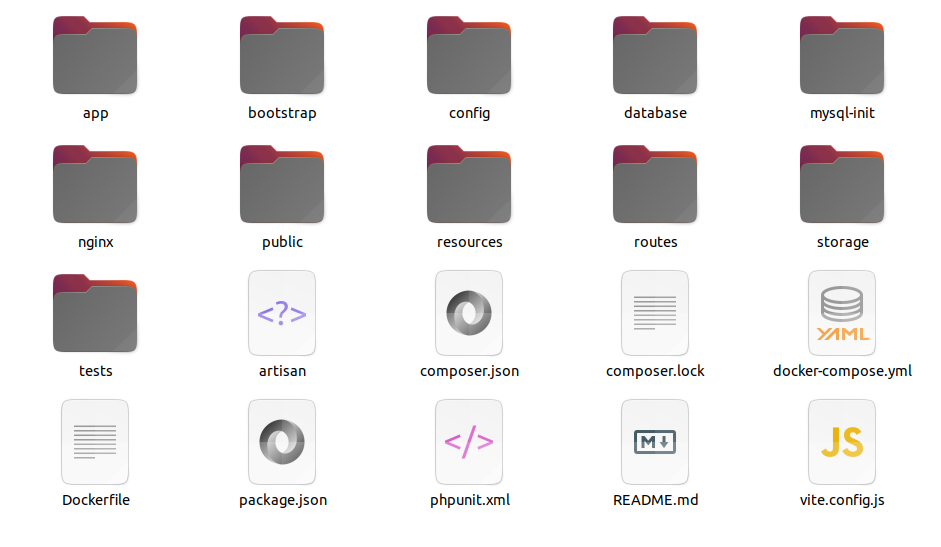
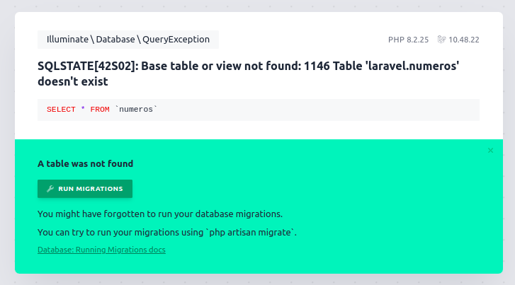
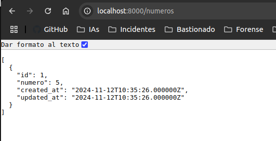
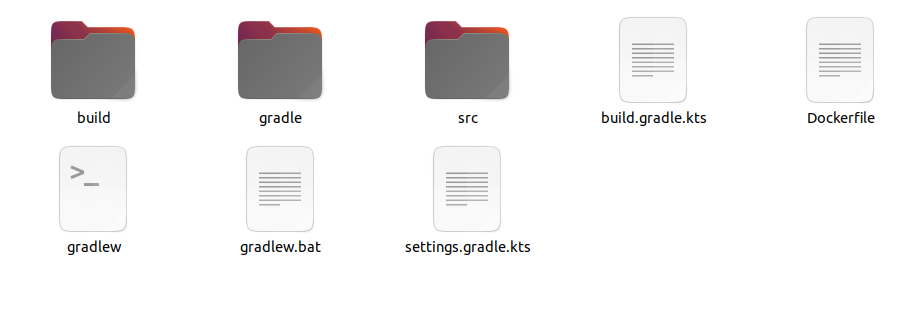
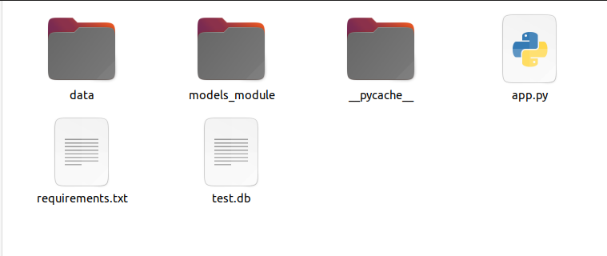
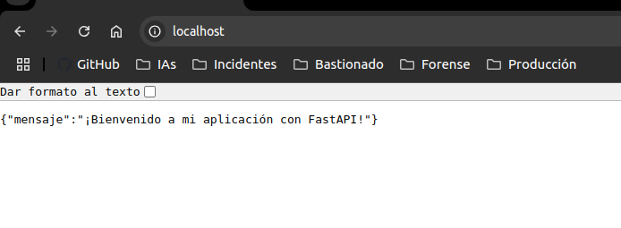

# Documentación para desplegar APIs usando Docker

## Laravel

Lo primero que tenemos que hacer es descargarnos la API del siguiente repositorio de [Laravel](https://github.com/SataNico04/PPS-Despliege-Laravel-G4).



En el repositorio ya se encuentran todos los archivos necesarios para la creación del docker, lo único que falta es el .env, que guarda información confidencial de la API. Podemos crear un nuevo .env a partir del .env.example.

Podrás notar que el repositorio tiene unos archivos/directorios *extra*, como las carpetas mysql-init y nginx, y los ficheros docker-compose.yml y Dockerfile.

Vamos a verlos con más detalle:

- Dockerfile.
  Crea un Docker con PHP y las dependencias necesarias para poder ejecutar Laravel.
  (Instalar paquetes, copiar carpetas a la carpeta de trabajo y cambiar permisos).

- docker-compose.yml.
  Crea los servicios que va a utilizar la API de Laravel. Una app, o contenedor principal de la app, que incluye todos los ficheros del directorio donde se encuentra, un nginx que va a alojar la API y usará los archivos de la carpeta **nginx/** y una base de datos Mysql que guardará todas las peticiones POST.

- mysql-init.
  En esta carpeta se encuentra un archivo .sql, que ejecuta un comando de base de datos que, si existe la base de datos, la borra y crea una nueva.

- nginx.
  Contiene un default.conf, un archivo necesario para la configuración del **nginx**

Por último, para desplegarlo, debemos poner los siguientes comandos en la consola:

```bash
docker compose build
docker compose up -d
```

Ahora, podríamos entrar en la siguiente URL: http://localhost:8000/numeros, nos dará un pequeño error, ya que no hemos aplicado las migraciones, no pasa nada, le damos clic al botón verde donde pone "Run Migrations", y si recargamos:



Nos aparecerá un json vacío. Si hacemos un POST usando *curl*:

```bash
curl -X POST http://localhost:8000/numeros -H "Content-Type: application/json" -d '{"numero": 5}'
```



---

## Springboot

Nos descargamos el contenido del siguiente repositorio [Springboot](https://github.com/IES-Rafael-Alberti/PPS-despliegue-springboot-g4). 



En la carpeta *demo/demo*, encontramos un Dockerfile, el cual contiene 2 etapas:
1. Etapa de construcción.
   Usa una imagen de Gradle para compilar la aplicación Java, generando un archivo .jar en el directorio build/libs.

2. Etapa de ejecución.
   Usa una imagen ligera de Java para ejecutar el archivo .jar generado en la etapa anterior, exponiendo el puerto 8080 para acceder a la aplicación.

Para desplegar el docker ponemos los siguientes comandos:

```bash
docker build -t springboot-app .
docker run -p 8080:8080 springboot-app
```

De esta forma, la API ya estaría desplegada en la siguiente URL: http://localhost:8080/.

---

## FastApi

Lo primero que haremos es clonar el repositorio de [FastAPI](https://github.com/IES-Rafael-Alberti/PPS-despliegue-fastapi-g4). 



Una vez en nuestro sistema, añadimos el siguiente archivo Dockerfile:

```Dockerfile
FROM python:3.11-slim

WORKDIR /code

# Copiar requirements.txt
COPY requirements.txt .

# Instalar dependencias
RUN pip install --no-cache-dir --upgrade -r requirements.txt

# Copiar el resto de los archivos y carpetas
COPY app.py .
COPY data/ ./data/
COPY models_module/ ./models_module/
COPY test.db .

# Comando para ejecutar la aplicación
CMD ["uvicorn", "app:app", "--host", "0.0.0.0", "--port", "8000"]
```

Este Dockerfile:

- Usa una imagen base de Python 3.11 ligera
- Establece el directorio de trabajo
- Copia e instala las dependencias
- Copia el código de la aplicación
- Configura el comando para ejecutar la aplicación con Uvicorn

Modificación del archivo requirements.txt (para forzar que sean exactamente esa versión o dará error):

        fastapi==0.115.4
        uvicorn==0.22.0
        sqlalchemy==2.0.15
        databases==0.9.0

Construcción de la imagen Docker
Abre una terminal en el directorio del proyecto y ejecuta:

  docker run -p 80:80 fastapi-app

Este comando construirá la imagen Docker con el nombre "mifastapi"

Ejecución del contenedor

Para ejecutar la aplicación en un contenedor, usa:

  docker run -d -p 80:80 fastapi-app

Este comando:

- Ejecuta el contenedor en segundo plano (-d)
- Le asigna un nombre al contenedor
- Mapea el puerto 80 del contenedor al puerto 80 del host



## Next

Podemos descargar el siguiente repositorio [Next](https://github.com/IES-Rafael-Alberti/PPS-despliegues-next-G4), o crear la app desde 0.


#### 1. Configuración del Proyecto en Next.js
1. **Crea un nuevo proyecto en Next.js**:
   ```bash
   npx create-next-app@latest todo-api
   cd todo-api
   ```

2. **Instala las dependencias necesarias**:
   No necesitas `mysql2` ni `dotenv` para este ejemplo sin base de datos.

#### 2. Crea un Archivo con los Datos de `todos`
En lugar de utilizar una base de datos, almacenaremos los `todos` directamente en un archivo.

Crea un archivo `src/data/todos.js` con el siguiente contenido:

```javascript
const todos = [
  { id: 1, title: 'Aprender Next.js', completed: true },
  { id: 2, title: 'Construir una API simple', completed: false },
  { id: 3, title: 'Desplegar en Vercel', completed: false },
];

export default todos;
```

#### 3. Crea las Rutas de la API
1. **Crea `src/pages/api/todos/index.js` para manejar las solicitudes `GET`**:
   ```javascript
   import todos from '../../../data/todos';

   export default function handler(req, res) {
     if (req.method === 'GET') {
       res.status(200).json(todos);
     } else {
       res.setHeader('Allow', ['GET']);
       res.status(405).end(`Method ${req.method} Not Allowed`);
     }
   }
   ```

#### 4. Ejecuta tu Proyecto Next.js
Ejecuta tu aplicación en modo desarrollo:
```bash
npm run dev
```

#### 5. Prueba los Endpoints con `cURL`
- **GET para obtener todos los todos**:
   ```bash
   curl http://localhost:3000/api/todos
   ```
   
#### 6. Despliegue en vercel


Para desplegar en vercel simplemente, metemos el repostiorio en este formulario y te genera una url con el proyecto desplegado


Me ha dado esta [url](https://pps-despliegue-vercel-g4-git-main-ales-projects-3125483c.vercel.app/api/todos), la cual podemos ver los todos que tenemos en el proyecto 


